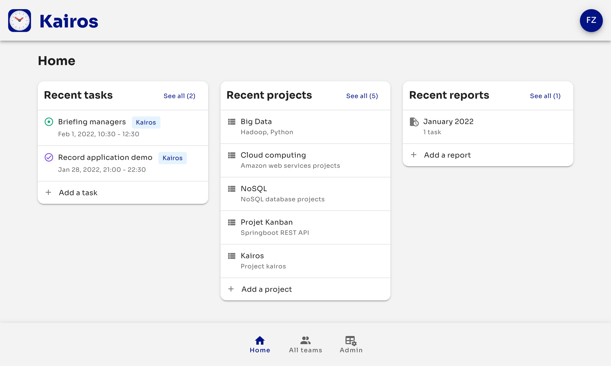

# Kairos

This application was realized at Télécom Saint-Étienne for the startup project course.

## Subject

This web application allows the entry, consultation and edition of time spent working on a task in a company.

There are three types of level:

- users can create, modify, delete tasks and generate reports
- managers can do the same thing as users with the added ability to manage their team and see the tasks of their
  users. They can also delete reports to allow their users to modify old tasks.
- admins can do the same thing as managers and users with the possibility to add admin and manager accounts.

## Architecture

This application is divided into several microservices hosted on other repos:

- [kairos-backend](https://github.com/tse-projects/kairos-backend), a NodeJS server with the AdonisJS framework to
  manage resources
- [kairos](https://github.com/tse-projects/kairos), an authentication server made with Spring Boot and Spring Security
- [kairos-app](https://github.com/tse-projects/kairos-app), a NuxtJS server for the client application

The backend server communicates with a PostgresSQL database and S3 file storage. All these services are hosted on
DigitalOcean. The Nuxt, Adonis and Spring boot servers are deployed on the "App platform", the database and the S3
bucket are services managed by DigitalOcean. Here is a diagram of the infrastructure :


## Database scheme


```sql
create database "kairos-db"
    with owner kairos;

create table kairos_user
(
    id         serial
        constraint user_pk
            primary key,
    firstname  varchar(100) not null,
    lastname   varchar(100) not null,
    email      varchar(320) not null
        constraint ukmht5uc7h2oo1carmt0c5yaeow
            unique,
    password   text,
    role       varchar(20),
    manager_id integer
);

alter table kairos_user
    owner to kairos;

create unique index user_email_uindex
    on kairos_user (email);

create table frozen_month
(
    id      serial
        constraint frozen_month_pk
            primary key,
    month   date    not null,
    user_id integer not null
        constraint frozen_month_user_id_fk
            references kairos_user
            on update cascade on delete cascade,
    path    varchar(300)
);

alter table frozen_month
    owner to kairos;

create unique index frozen_month_path_uindex
    on frozen_month (path);

create table project
(
    id          serial
        constraint project_pk
            primary key,
    name        varchar(100) not null,
    description text,
    color       varchar(10)
);

alter table project
    owner to kairos;

create table task
(
    id              serial
        constraint task_pk
            primary key,
    project_id      integer
        constraint task_project_id_fk
            references project
            on update cascade on delete cascade,
    user_id         integer                  not null
        constraint task_user_id_fk
            references kairos_user
            on update cascade on delete cascade,
    start           timestamp with time zone not null,
    "end"           timestamp with time zone not null,
    name            varchar(100)             not null,
    description     text,
    frozen_month_id integer
        constraint task_frozen_month_id_fk
            references frozen_month
            on update cascade on delete set null
);

alter table task
    owner to kairos;


```

## Screenshots & Videos

### User


### Manager


### Admin




## Build Setup

```bash
# install dependencies
$ npm install

# serve with hot reload at localhost:3000
$ npm run dev

# build for production and launch server
$ npm run build
$ npm run start

# generate static project
$ npm run generate
```

For detailed explanation on how things work, check out the [documentation](https://nuxtjs.org).

## Special Directories

You can create the following extra directories, some of which have special behaviors. Only `pages` is required; you can
delete them if you don't want to use their functionality.

### `assets`

The assets directory contains your uncompiled assets such as Stylus or Sass files, images, or fonts.

More information about the usage of this directory
in [the documentation](https://nuxtjs.org/docs/2.x/directory-structure/assets).

### `components`

The components directory contains your Vue.js components. Components make up the different parts of your page and can be
reused and imported into your pages, layouts and even other components.

More information about the usage of this directory
in [the documentation](https://nuxtjs.org/docs/2.x/directory-structure/components).

### `layouts`

Layouts are a great help when you want to change the look and feel of your Nuxt app, whether you want to include a
sidebar or have distinct layouts for mobile and desktop.

More information about the usage of this directory
in [the documentation](https://nuxtjs.org/docs/2.x/directory-structure/layouts).

### `pages`

This directory contains your application views and routes. Nuxt will read all the `*.vue` files inside this directory
and setup Vue Router automatically.

More information about the usage of this directory
in [the documentation](https://nuxtjs.org/docs/2.x/get-started/routing).

### `plugins`

The plugins directory contains JavaScript plugins that you want to run before instantiating the root Vue.js Application.
This is the place to add Vue plugins and to inject functions or constants. Every time you need to use `Vue.use()`, you
should create a file in `plugins/` and add its path to plugins in `nuxt.config.js`.

More information about the usage of this directory
in [the documentation](https://nuxtjs.org/docs/2.x/directory-structure/plugins).

### `static`

This directory contains your static files. Each file inside this directory is mapped to `/`.

Example: `/static/favicon.ico` is mapped as `/favicon.ico`.

More information about the usage of this directory
in [the documentation](https://nuxtjs.org/docs/2.x/directory-structure/static).

### `store`

This directory contains your Vuex store files. Creating a file in this directory automatically activates Vuex.

More information about the usage of this directory
in [the documentation](https://nuxtjs.org/docs/2.x/directory-structure/store).
